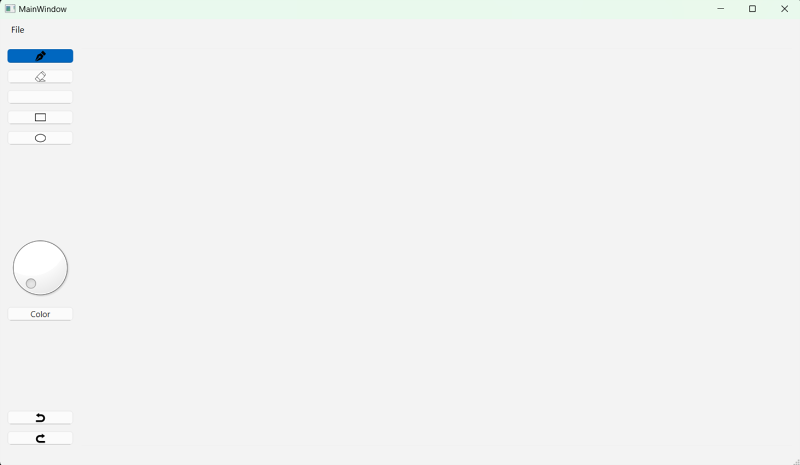

# Best Notes
BestNotes is a Python recreation of the app/program GoodNotes, a note-taking application. 
The user gets to create a digital notebook 
where they can write down notes for class or personal uses like journaling.
Through either drawing by their mouse or a stylus, users can create drawings as well as hand-written notes 
that they can easily move around by using a select tool. The program will also have a text feature, 
that allows the user to type their notes, which is easily moveable through the select tool. 
The notebooks have an autosave feature that saves these notebooks to the user’s devices. 
This program also has a collaboration feature that allows users to work together on a notebook. 



# How to run

Provide here instructions on how to use your application.   
- Download the latest binary from the Release section on the right on GitHub.  
- On the command line uncompress using
```
tar -xzf  
```
- On the command line run with
```
./hello
```
- You will see Hello World! on your terminal.

# How to contribute
Follow this project board to know the latest status of the project: [BestNotes Project Board](https://github.com/orgs/cis3296f24/projects/94/)

## How to build
- Use this github repository: ... 
- Specify what branch to use for a more stable release or for cutting edge development.  
- Use InteliJ 11
- Specify additional library to download if needed 
- What file and target to compile and run. 
- What is expected to happen when the app start. 

### Windows instructions
- TBD

### Mac Instructions
For mac, you will need to download the IntelliJ IDE. You can download it from the following link:
https://www.jetbrains.com/idea/download/?section=mac

You will also need to download python, ideally the latest version. You can download it from the following link:
https://www.python.org/downloads/

Once that is completed, do the following:
- Clone the repository into IntelliJ. Make sure you do not save the repository to your desktop (Documents is an easy choice)
- Open the repo in Intellije and navigate to main.py. In the upper right hand corner a link saying "Configure Python Interpreter" should appear. Clicking it will allow you to set up a virtual environemnt to run the project.
- In the dialogue box an option to choose the SDK (Software Development Kit) should be present and say <No Project SDK>. Click this and choose "Add python SDK from disk"
- In the new diaglogue box, to the left the top option, "Virtualenv Environment" should be highlighted. New environment should be checked. In the Base Interpreter Box, it will automatically navigate to the version of python you downloaded, but if not, click the three dots next to the box to manually navigate to it. It will typically be under /usr/local/bin/python3.13 for example, if you downloaded python 3.13. Clicking OK will create the virtual environment.
- Once this is done, navigate to terminal by clicking the magnifying glass on the right side of the menu bar, type "terminal" and enter, which will open terminal.
- Now you need to navigate to the project. You can do this using the command, "cd Documents", followed by "cd 01-BestNotes" or cd and the name you chose for the cloned repository.
- Once you have navigated to BestNotes, type "source venv/bin/activate" to activate the virtual environment. It should say (venv) (base) <rest of command line>
- Now type the command "pip3 install pyside6"
- Once the download has completed, return to IntelliJ and hit the play button to run main.py and use the application.

PDF Instructions: [Best Notes Mac Set Up Instructions.pdf](https://github.com/user-attachments/files/17577744/Best.Notes.Mac.Set.Up.Instructions.pdf)

